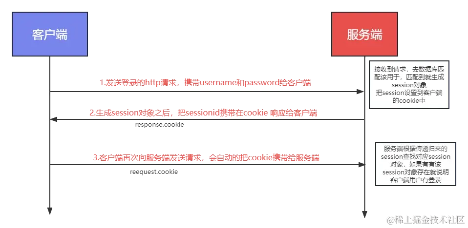

### 什么是Session？
`session`字面意义就是会话，主要用作客户端和服务端之间在数据交互上的身份认证。

由于HTTP是无状态协议，在客户端和服务端的交互中，服务端并不知道用户是否有权限访问相应的数据，或者说，服务端无法识别请求数据的是哪个用户，这也导致数据的安全性无法得到保障。

为了保持客户端和服务端之间的联系，才有了session的出现，session就是用来在服务端保存用户状态的实现方式，通常用来保存用户的登录状态。

### 工作原理

#### Session如何存储用户状态 
session以 key=value 的格式保存在服务端，通常是保存在内存中，当然也可以保存在文件或者数据库等等，保存的这个数据称之为session对象，每一个session对象都会存在一个sessionid，客户端和服务端就是通过sessionid来关联的

#### Session的工作流程
1. 客户端向服务端 发送登录HTTP请求，如果这个用户首次访问服务器的时候，服务器为这个用户单独创建一个 Session 对象，并分配一个新的 SessionID，此时 SessionID 通过 cookie 保存在客户端 。
2. 客户端之后的每一次HTTP请求，cookie中sessionid都会随着cookie传递到服务端，服务端就根据传递过来的sessionid对用于进行身份的验证。

进一步理解就是，当客户端第一次向服务端发起请求时，服务端都会创建一个Session对象，同时会创建一个对应的sessionId并存到cookie中发给客户端，后面客户端的每次请求都会通过cookie携带sessionId给到服务端，服务端拿到sessionId后，去存储区找到Session对象，从Session对象中拿到用户数据。

登录验证其实就是服务端通过sessionId获取到的Session对象中是否有用户信息，有的话说明登录了，没有的话说明还没登陆。

### Session的优缺点

#### 优点

1) 相比传统的cookie存储所有用户信息来讲，session的数据存储服务器端，用户数据更安全。
2) 每次请求不需要在请求体或者请求接口中携带用户信息给服务端。

#### 缺点
1) session都是保存在服务端的内存中，而随着认证用户的增多，服务端的开销会明显增大。
2) cookie如果被截获，用户就会很容易受到跨站请求伪造的攻击。
3) 多服务器请求session不能实现共享问题，session只适用一个所有数据都在同一个服务器请求，因为提供登录的数据接口的服务器才会有session信息。
4) 跨域设置问题，sessionid会直接设置在cookie中，如果客户端和服务端不是同一个服务器，cookie设置会存在跨域问题。 

注意点：虽然在配置session的时候可以设置session的过期时间，但是如果你重新启动了服务端的服务器，那么之前的session对象都会被清空，必须得重新登录生成session哦。

